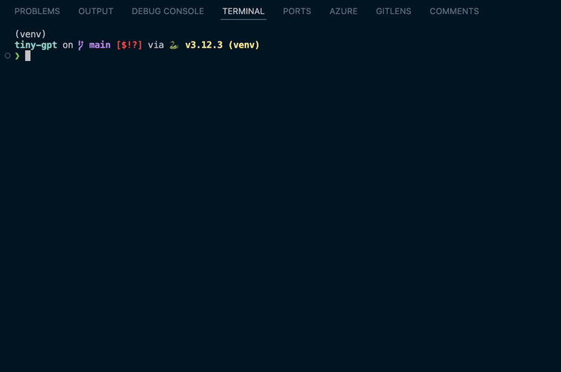
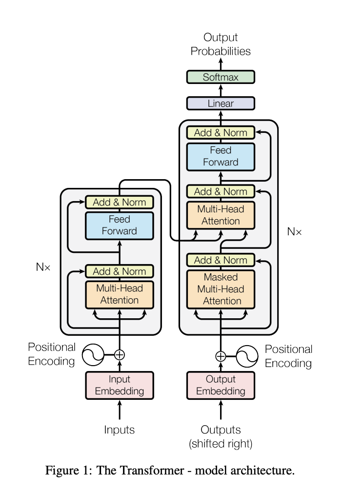
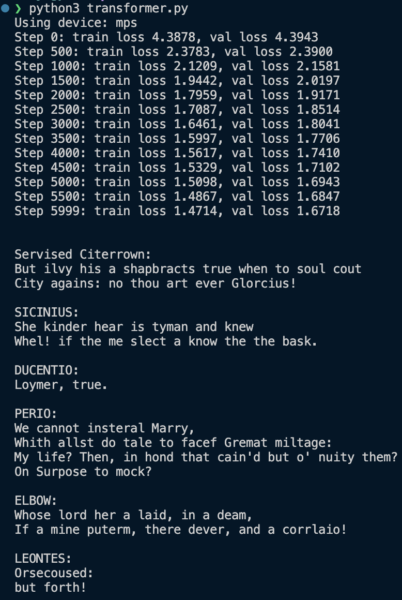
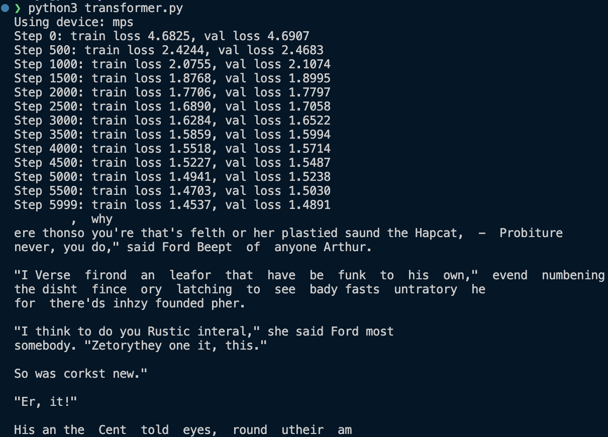
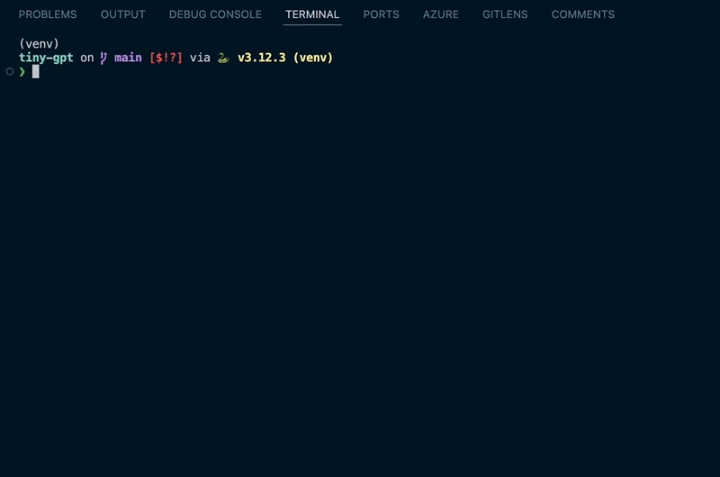

# TinyGPT 🤖

A tiny GPT (Generative Pretrained Transformer) written from scratch in Python, using Pytorch. Created by following [Andrej Karpathy's tutorial on YouTube](https://www.youtube.com/watch?v=kCc8FmEb1nY). A simple TUI is also made for generating text from different models.

_Model trained on Shakespear generating text based on user input (1.5x speed)_

Karpathy's tutorial shows how to create a decoder-only transformer (same structure as OpenAI's GPT) based on the famous [_Attention is All You Need_ paper](https://arxiv.org/abs/1706.03762). Another great resource is [3b1b's video](https://www.youtube.com/watch?v=eMlx5fFNoYc&t=790s), which gives a visual explanation of how the attention mechanism works.

The architecture of transformer is shown below. The right side of the architecture is the decoder part (except for the Multi-Head Attention receiving key and values from encoder part):

## Installation 📦

To install the required packages, use the following command: `pip install -r requirements.txt`

## Running a model

To run a model, use the following command: `python3 generate.py [model_name]`.

The `model_name` should be the name of the directory in `/models` that have the model weights. This parameter is optional, if no model_name is provided, a model trained on the tiny Shakespear dataset will be loaded.

`>>` indicates the user input that the GPT will complete up to 500 new tokens. The GPT has a context window of 128 tokens, meaning that only the last 128 tokens of the user input will be fed to the model. A token in this case is a UTF-8 character.

To exit the program enter `quit`.

## Training a transformer

To train a transformer, run `python3 train.py`.

You can change the hyperparameters as well as the training data in the same file. The trained model will be saved in a new directory in `/models`.

## Results ✅

Karpathy managed to get a validation loss of ~1.48 when training for 5000 iterations on the tiny Shakespear dataset. He trained on a A100 GPU, and was therefore able to train a larger transformer with a higher dimension embedding space.

I trained on an Apple M2 Pro, and therefore had a smaller transformer architecture which I trained for 6000 iterations. On the same dataset, I was able to get a validation loss of ~1.67. As I was training on an Apple silicon chip, I set PyTorch device to "mps" which accelerated training. The training took about 10 minutes. Below is the training run, and also some text generated by the trained model:

Out of curiosity I also trained models on _The Hitchhiker's Guide to the Galaxy_, which is a book I have recently read and enjoyed. The result is shown below:

Below is another example of completion with user input:

_Model trained on The Hitchhiker's Guide to the Galaxy generating text based on user input (1.5x speed)_

The generated texts are nonsensical and have a lot of made-up words, but they still manage to get the structure of the text as well as some words/names right!
